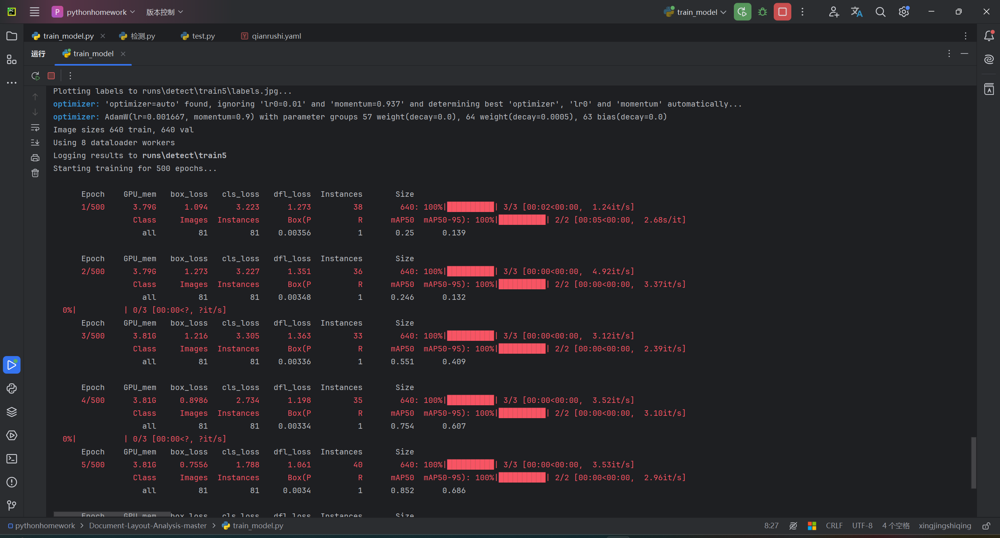

# smart_garbagebin_based_on_STM32F7

<!-- 项目徽标 -->
 

<h3 align="center">基于STM32F7的图像识别智能垃圾桶</h3>

  

    一款应用的YOLOv5的轻量化智能垃圾桶
    

<!-- 目录 -->

  
目录

  <ol>
    <li>
      <a href="#about-the-project">项目简介</a>
      <ul>
        <a href="#built-with">技术栈</a></li>
      </ul>
        <li><a href="#prerequisites">环境依赖</a></li>
      </ul>
    </li>
    <li><a href="#works-cited">参考资料</a></li>
  </ol>

<!-- 项目简介 -->
## 项目简介

为了实现各种垃圾的分类识别，我们使用YOLOv5在pycharm中进行了训练。
使用的数据集数据集包含4235张垃圾图片，按照8：2的比例划分训练集和测试集。

尽管资源有限，模型仍然表现出不错的效果，在实际的垃圾检测中验证了 YOLOv5 模型的强大性能。

(<a href="#top">回到顶部</a>)

### 技术栈

本项目使用了以下技术：

* [YOLOv5](https://ultralytics.com/yolov5)
* PWM信号控制舵机旋转

(<a href="#top">回到顶部</a>)

### 环境依赖

请先确保你已安装以下环境：

1. Python 3
2. rtthread studio
3. ultralytics
4. openCV

### 参考资料
[1]许鹏,卢姿彤,杨永杰.适用于嵌入式系统的改进YOLOv5轻量模型[J].电子设计工程,2025,33(13):21-27+33.DOI:10.14022/j.issn1674-6236.2025.13.005.

[2]吴燕燕,包梓含,汪凌志,等.多任务垃圾智能分拣试验装置设计[J].机械设计,2025,42(S1):121-125.DOI:10.13841/j.cnki.jxsj.2025.s1.016.

[3]谢佩嘉,李红双,朱天一,等.一种基于机器视觉的室内分类垃圾桶设计[J].机械设计,2025,42(S1):126-131.DOI:10.13841/j.cnki.jxsj.2025.s1.019.

[4]林隽生,何旭婷.基于STM32的四轴运动控制卡在投包机电机控制的应用[J].漳州职业技术,2025,27(02):102-108.DOI:10.13908/j.cnki.issn1673-1417.2025.02.0015.

